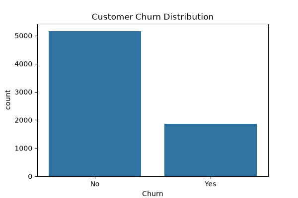
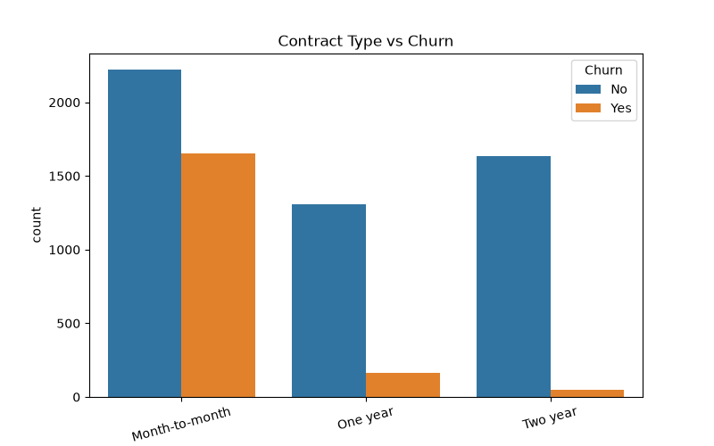
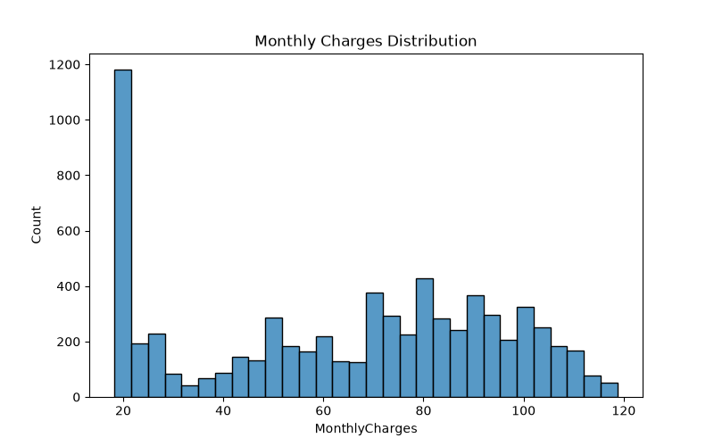
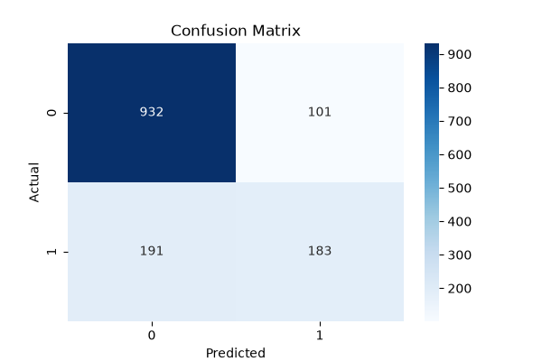

# Customer Churn Analysis

## Overview

This project analyzes customer behavior and predicts customer churn using machine learning techniques. The objective is to identify customers who are likely to leave a service and provide actionable insights that support customer retention strategies.

---

## Features

* Customer Churn Analysis
* Exploratory Data Analysis (EDA)
* Data Visualization
* Churn Prediction using Machine Learning
* Customer Retention Insights
* Performance Evaluation

---

## Technologies Used

* Python
* Pandas
* NumPy
* Matplotlib
* Seaborn
* Scikit-learn

---

## Dataset

The project uses the IBM Telco Customer Churn dataset, which contains customer demographics, account information, service usage details, and churn status.

---

## Project Workflow

1. Data Collection
2. Data Cleaning
3. Data Preprocessing
4. Exploratory Data Analysis
5. Feature Encoding
6. Model Training
7. Churn Prediction
8. Performance Evaluation

---

## Results

### Customer Churn Distribution

### Contract Type vs Churn

### Monthly Charges Distribution

### Confusion Matrix

---

## Model Performance

| Metric   | Value                    |
| -------- | ------------------------ |
| Model    | Random Forest Classifier |
| Accuracy | 79.25%                   |

---

## Key Insights

* Customers with month-to-month contracts showed higher churn rates.
* Contract type significantly influences customer retention.
* Monthly charges exhibit noticeable patterns among churned customers.
* Machine learning can effectively identify customers at risk of churn.

---

## Project Structure

Customer-Churn-Analysis/
│
├── data/
├── src/
│   ├── data_preprocessing.py
│   ├── analysis.py
│   └── churn_prediction.py
│
├── results/
│   ├── churn_distribution.png
│   ├── contract_vs_churn.png
│   ├── monthly_charges_distribution.png
│   └── confusion_matrix.png
│
├── dashboard/
├── notebooks/
├── README.md
├── requirements.txt
└── .gitignore

---

## Author

**Panjala Shambhavi**

B.Tech Artificial Intelligence & Machine Learning (AIML)
